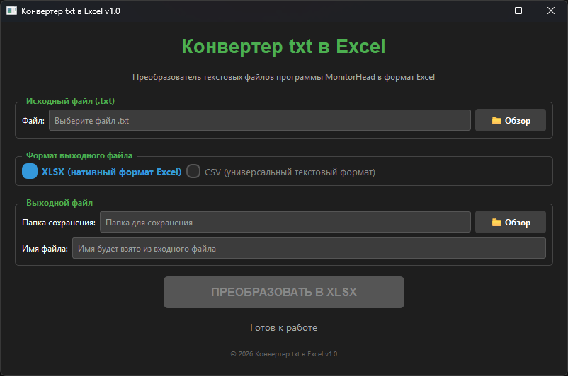
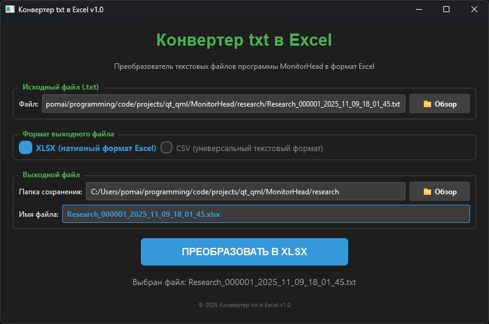
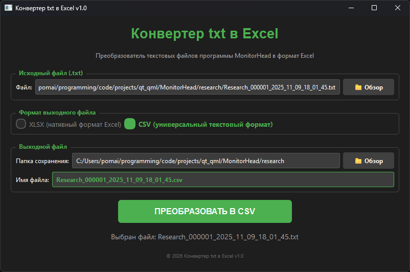

# ConverterTxtToXlsx

# О проекте

Этот проект создавался как вспомогательная программа к проекту MonitorHead для преобразования текстовых файлов в формат файлов которые будут читаться Excel. При этом приложение должно быть с графическим интерфесом (GUI), потому что пользоваться будут обычные пользователи.

Изначально я предполагал писать его только на C++ и Qt(QML). Удалось написать проект на этом стеке в конвертацию в *.csv и после чего я упёрся в реализацию работы с конвертированием в *.xlsx. 

После чего по-изучав информацию, пришёл к выводу, что нужно писать на Python с его доступными и простыми библиотеками в частности для работы Excel - `openpyxl`. В итоге использовался следующий интсрументарий:

| Инструмент | Описание | Альтернатива | Примечания |
|---|---|---|---|
| PySide6 | Библиотека для создания графического интерфейса (GUI) | PyQt6, Tkinter, Kivy | вместо PyQt6 - бесплатная лицензия, тот же функционал |
| pandas | Библиотека для работы с табличными данными | csv модуль, numpy | Обработка и преобразование данных |
| openpyxl | Библиотека для работы с Excel файлами (.xlsx) | xlsxwriter, pandas только | Создание Excel файлов |
| chardet | Библиотека для определения кодировки файлов | charset-normalizer | Автоматическое определение кодировки TXT файлов |

Эта программа преобразует выбранный *.txt файл в файл с расширением *.csv или *.xlsx, для открытия в Excel.

**Основная задача программы** — конвертировать файл программы MonitorHead в формат файла для открытия в Excel.

Программа имеет опцию выбора исходного файла, выбора директории сохраниния и названия выходного файла и выбора в какой формат сохранять *.csv или *.xlsx. При выборе исходного файла, автоматически считываются путь и название файла и подставляются в соответствующие строки пути и названия выходного файла. Если выбранная директория или названия файла не подходят, то их можно поправить. После того как всё будет настроено, нажимаем кнопку "Преобразовать", и программа конвертирует исходный файл в выходной файл. Программа перед конвертацией проверяет есть ли такое же название файла по выбранному пути. 

# Проект на Python

Проект лежит в папке `Converter_python_exe`.

В этой папке есть несколько файлов

| Название файла | Назначение |
|---|---|
| build_exe.py | Скрипт для создания .exe файла |
| check_deps.py | Скрипт для проверки окружения |
| converter_app.py | Основной скрипт конвертера, который с помощью скрипта build_exe.py переделывается в программу .exe |

